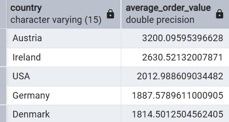

# Average Order Value by Country

## Problem
Which countries generate the highest average order value?

## Goal
Calculate the average revenue per order by customer country.

## Query
```sql
WITH total_orders AS (
  SELECT od.order_id, c.country, SUM(od.unit_price * od.quantity * (1 - od.discount)) AS total_order_value
  FROM customers AS c
  JOIN orders AS o ON c.customer_id = o.customer_id
  JOIN order_details AS od ON o.order_id = od.order_id
  GROUP BY od.order_id, c.country
)
SELECT country, AVG(total_order_value) AS average_order_value
FROM total_orders
GROUP BY country 
ORDER BY AVG(total_order_value) DESC;
```


