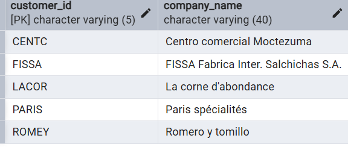

# Customers with No Orders in 1997

## Problem
Which customers did not place any orders in 1997?

## Goal
Identify inactive customers in 1997.

## Query
```sql
SELECT customer_id, company_name
FROM customers 
WHERE customer_id NOT IN (
  SELECT customer_id
  FROM orders
  WHERE EXTRACT(YEAR FROM order_date) = 1997
);
```


