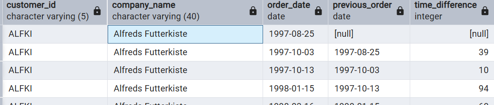

# Returning Customers — Time Between Orders

## Problem
Marketing wants to know how often customers return — that is, the time between their current and previous orders.

## Goal
Calculate the time gap between consecutive orders for each customer.

## Query
```sql
WITH customer_orders AS (
  SELECT 
    c.customer_id, 
    c.company_name, 
    o.order_date,
    LAG(order_date) OVER (
      PARTITION BY c.customer_id 
      ORDER BY o.order_date ASC
    ) AS previous_order
  FROM customers AS c
  JOIN orders AS o ON c.customer_id = o.customer_id
),
return_period AS (
  SELECT 
    *, 
    (order_date - previous_order) AS time_difference
  FROM customer_orders
)
SELECT *
FROM return_period;
```


