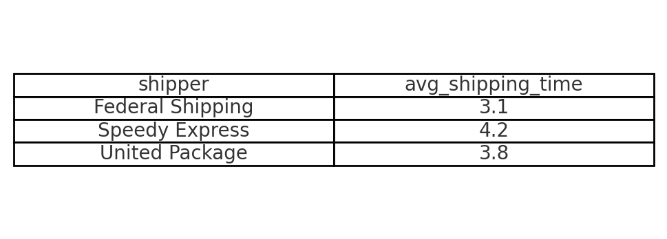

# Average Shipping Time per Shipper

## Problem
How efficient are the shippers in fulfilling orders?

## Goal
Calculate the average number of days it takes each shipper to deliver an order.

## Query
```sql
SELECT s.company_name AS shipper, AVG(o.shipped_date - o.order_date) AS avg_shipping_time
FROM shippers AS s
JOIN orders AS o ON s.shipper_id = o.ship_via
WHERE shipped_date IS NOT NULL AND order_date IS NOT NULL
GROUP BY s.company_name;
```


