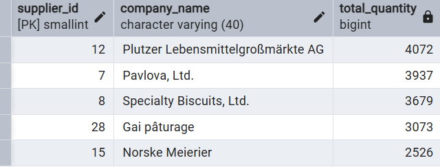

# Top Suppliers by Product Volume

## Problem
Which suppliers contribute the most to product volume?

## Goal
Identify the top suppliers by total product quantity supplied.

## Query
```sql
SELECT s.supplier_id, s.company_name, SUM(od.quantity) AS total_quantity
FROM order_details AS od
JOIN products AS p ON od.product_id = p.product_id
JOIN suppliers AS s ON p.supplier_id = s.supplier_id
GROUP BY s.supplier_id, s.company_name
ORDER BY SUM(quantity) DESC
LIMIT 5;
```


